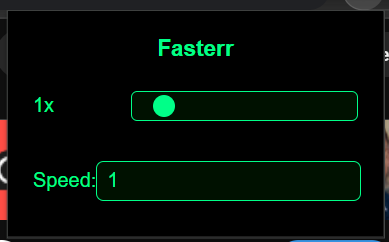

# ⚡️ Fasterr

**Fasterr** is a lightweight Chrome extension that lets you tweak YouTube playback speed beyond the default limits — go **over 2x** or **under 0.25x** with full control.

## 🚀 Features

- Adjust speed from **0.0625x** to **16x**
- Manual input + interactive slider
- Remembers your last used speed

## 🧩 Installation

1. Download zip and extract or clone this repo.
2. Go to `chrome://extensions/`
3. Enable **Developer Mode** (top right).
4. Click **"Load unpacked"**
5. Select this folder
6. You're all set.

## 🛠 How it Works

- Applies your chosen playback rate to the active YouTube tab.
- Uses `chrome.storage.local` to save your last speed setting.
- Works instantly — no refresh needed.

## ⚠️ Requirements

- Chrome or any Chromium-based browser (Brave, Edge, Vivaldi...)
- YouTube open in the active tab

## 📸 Preview

## ✨ Author

Built by [Vizz](https://github.com/yourusername)

---
